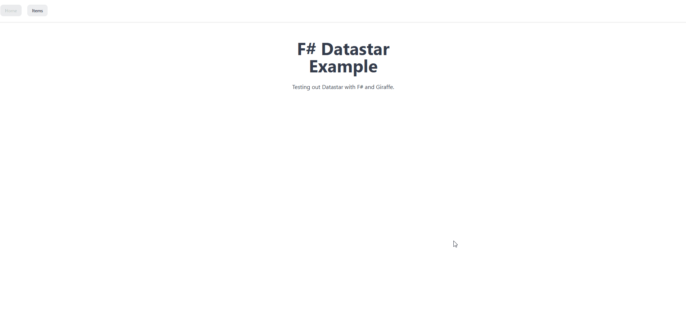

# F# Datastar Example



## Setup
Install .NET SDK.
```shell
winget install Microsoft.DotNet.SDK.9
```

Install tools.
```shell
dotnet tool restore
```

Install dependencies.
```shell
dotnet paket install
```

## Usage
Run the application.
```shell
dotnet run --project src/App/App.fsproj
```
> Navigate to `http://localhost:5000` in your web browser to see the application in action.

## Resources
- [Functional Event Sourcing Decider](https://thinkbeforecoding.com/post/2021/12/17/functional-event-sourcing-decider)
- [The Equinox Programming Model](https://nordfjord.io/equinox/)
- [DDEU Deciders](https://codeberg.org/thinkbeforecoding/dddeu-2023-deciders)
